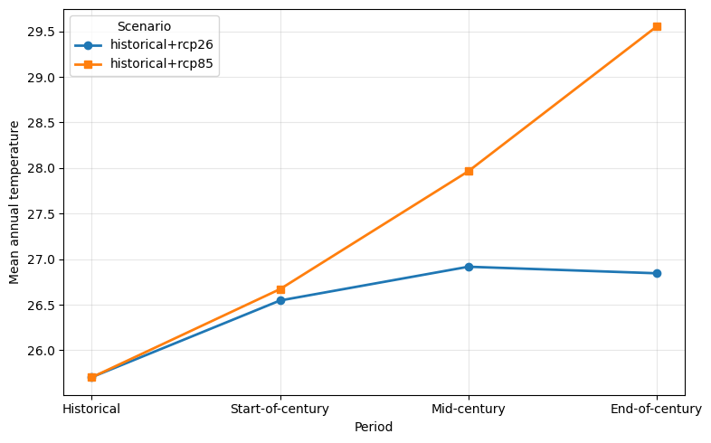
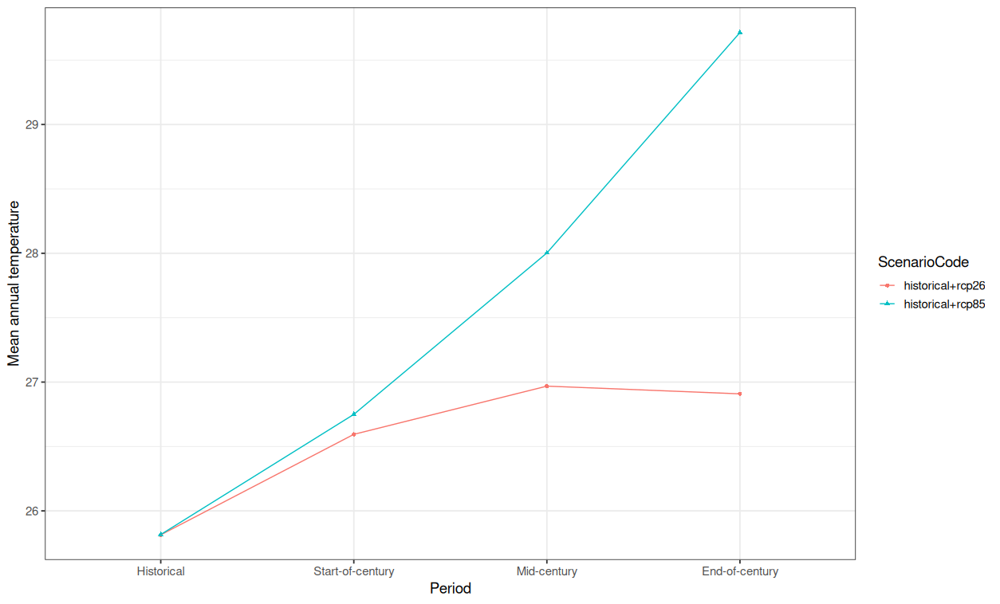

# Tutorial - Visualisation and use of KAPy outputs

## Goal

To demonstrate a few approaches to visualisation of KAPy outputs

## What are we going to do?

In this tutorial we will import and plot results from a KAPy run using both R and Python.

## Point of departure

This tutorial uses the results of [Tutorial 01](Tutorial01.md) as the input dataset, but in principle and be adapted to work with any KAPy pipeline that has been run to completion.

## Background 

KAPy produces two key types of data: I) indicators on a raster and II) indicators averaged over a area (e.g. a polygon such as a municipal boundary, national border or watershed). Type I data (hereafter "gridded data") is stored both for the individual ensemble members and also as ensemble statistics, and can be explored readily using tools such as [`ncview`](https://cirrus.ucsd.edu/ncview/). Type II data (hereafter "areal data") is trickier in some ways and easier in others: KAPy saves these as intermediate files in a text-based .csv format, meaning that they can be imported into a spreadsheet or scripting language with ease. 

The areal data can be broken down into a further two types - one corresponding to statistics calculated over a polygon on the individual ensemble members, and the other on the ensemble statistics (e.g. percentiles). The exact nature of the output depends on the configuration - it can often be advantangeous to turn off one or more of these options to increase processing speed. Configuration is achieved using the `areal_statistics` argument in the `config.yaml` file, and is set as follows:
```
areal_statistics:
    ensemble_areal_statistics: True
    member_areal_statistics: False
```
To facilitate processing of these different types of data, KAPy collects them all together in the form of a single SQLite database. SQLite is a self-contained and lightweight database system that is well established and broadly used. It has the advantage of not requiring a dedicated server (either hardware or software), as the machinery for interacting with the database is contained in the locally installed software package. SQLite is therefore commonly used in lightware applications, such as mobile telephones, and as a general rule-of-thumb is well suited to databases less than 1TB in size. While the use of such databases is less common in climate science, it is well known in computer science. The database is accessed using the `sqlite3` package in Python, and the `RSQLite` package in R. In this tutorial we will open the database, extract the data and make a plot of the results.

## Explore the database

As a way to familarise yourself with the structure of the KAPy output database, we will first perform a few simple explorations.

To explore an SQLite database, we recommend [`SQLitebrowser`](https://sqlitebrowser.org/), an open source tool available for both Windows and Linux. See the webpage for installation - on many Linux distributions it is often as simple as:
```
apt-get install sqlitebrowser
```

Depending on your system configuration, you may need to add `sudo` to the front of this command.

Now lets explore a bit.

1. The SQLite database can then be opened from the command line, with the path to the database as an argument:
```
sqlitebrowser outputs/KAPy_database.sqlite 
```

2. This will open a GUI, with four tabs. The "Database Structure" tab gives an overview of the tables in the database, together with the indices (which speed up searches dramatically) and the Views (which are efficient combinations of various Tables). 

3. Now switch to the "Browse Data" tab. This starts on the `Configuration` table, which stores the KAPy configuration used to generate the data. Click "Table" dropdown and change to `EnsembleArealStatistics`.   

4. Here you will see a datatable, with a large set of metadata columns and finally a `Value` column. But this might look a bit strange - why is the Season 5, or the Scenario 1? This is because it is much more efficient to store the metadata as a key code, rather than storing the full name of the model, scenario or season. If you switch to the `Seasons` table, you will see a list of the SeasonKeys, and here discover that SeasonKey=5 corresponds to annually averaged data.

5. This is fine from a data storage point of view, but is irritating to work with. So what do we do? This is where Views come into play - they join tables together based on their keys to give the information that we actually want. This process is done on the fly, thereby avoiding having to store large amounts of unnecessary data. To see what the result looks like, switch to the `View_EnsembleArealStatistics` table.

6. Here you will see that the keys have been switched out with the codes, and in most cases the descriptions, to give a much more human-friendly format that can be queired and worked with. As a result, you will generally work with the Views rather than the Tables, although there are also use cases where the tables can also be useful.

7. The KAPy database also contains a second view `view_GriddedFiles`. Switch to it. This is a conceptually similar table, but rather than containing the summary statistics and ensemble percentiles, it contains paths to the gridded versions of the indicators (relative to the SQLite database). This can be useful for more advanced analyses. If the `areal_statistics / member_areal_statistics` configuration system is enable, a third view, `view_MemberArealStatistics` is also created, which contains the same information as `view_EnsembleArealStatistics`, but for the individual ensemble members.

Ok. That gives us a quick introduction to the database. Now lets put the data to use.

## Loading and plotting data in Python

1. Start by loading your Python environment. We import three packages:

```{python}
import sqlite3
import pandas as pd
import matplotlib.pyplot as plt
```

2. We connect to the database using the `sqlite3` package:

```{python}
conn = sqlite3.connect("outputs/KAPy_database.sqlite")
```

3. We read the data using the `pd.read_sql` function, which is part of the `pandas` package. The `pd.read_sql` function takes two arguments - the SQL query to be executed, and the connection object. The query is a string, and is executed using the `sqlite3` package.
```{python}
query = """
SELECT *
FROM View_EnsembleArealStatistics
WHERE IndicatorCode = '101'
  AND SeasonCode = 'ann'
  AND StatisticTypeCode = 'mean'
  AND Percentile = 50
  AND Delta = 0
"""

temp = pd.read_sql(query, conn)
conn.close()
```

4. This does require writing SQL queries, which can be a bit intimidating. There are several workarounds if you're not into SQL. One approach is to use the ibis package - however, this is not included as a standard part of that KAPy environment. Large-language models are also very good at SQL and help you. A third approach is to the extract the entire table into a pandas dataframe, and then filter the data as required. e.g     
  ```{python}   
  temp = pd.read_sql("SELECT * FROM View_EnsembleArealStatistics", conn)
  ```


5. And now we can plot the data using the `matplotlib` package.
```{python}
# Plot
fig, ax = plt.subplots(figsize=(8, 5))

markers = ["o", "s", "^", "D", "v", "P", "X"]

for marker, (scenario, df) in zip(markers, temp.groupby("ScenarioCode")):
    ax.plot(
        df["TimeBinCode"],
        df["Value"],
        marker=marker,
        linewidth=2,
        label=scenario,
    )

ax.set_xlabel("Period")
ax.set_ylabel("Mean annual temperature")
ax.grid(True, alpha=0.3)
ax.legend(title="Scenario")

plt.tight_layout()
plt.show()
``` 



Ka pai!

This is a very basic example of how to work with the data, but the key mechanism of extracting the data  holds, regardless of how simple or complex an analysis one is making. Have a play, and see how you get on!

The full python script can be found in [Visualisation.py](Visualisation.py).


##  Loading and plotting data in R 
1. Start by loading your R environment - we recommend [R Studio](https://posit.co/download/rstudio-desktop). You'll need to make sure you have a couple of packages installed, in particular `tidyverse` and `dbplyr`. These can be installed using `install.packages(c("tidyverse","dbplyr"))` if you don't have them. Load the packages as follows:

```{r}
library(tidyverse)
library(dbplyr)
```

2. Now we want to connect to the data. We do this using the functionality in the `dbplyr` package, which provides functionality akin to the `plyr` package in R for working with data-frames (and tibbles) in the context of a database. The connection process involves two steps - first connecting to database object, and then to the table within the database :

```
#Connect to database
db <- DBI::dbConnect(RSQLite::SQLite(),"outputs/KAPy_outputs.sqlite")
dat <- tbl(db,"View_EnsembleArealStatistics")

```

3. Printing the object will give something similar to what you've already seen:

```
> dat
# Source:   table<`View_Ensemble_Statistics`> [?? x 15]
# Database: sqlite 3.50.4 [/dmidata/projects/klimaatlas/KAPy/outputs/KAPy_outputs.sqlite]
      id DatasetCode ScenarioCode     GridCode IndicatorCode IndicatorDescription    AreaKey
   <int> <chr>       <chr>            <chr>    <chr>         <chr>                     <int>
 1     1 CORDEX      historical+rcp26 Ghana025 101           Annual mean temperature      NA
 2     2 CORDEX      historical+rcp26 Ghana025 101           Annual mean temperature      NA
 3     3 CORDEX      historical+rcp26 Ghana025 101           Annual mean temperature      NA
 4     4 CORDEX      historical+rcp26 Ghana025 101           Annual mean temperature      NA
 5     5 CORDEX      historical+rcp26 Ghana025 101           Annual mean temperature      NA
 6     6 CORDEX      historical+rcp26 Ghana025 101           Annual mean temperature      NA
 7     7 CORDEX      historical+rcp26 Ghana025 101           Annual mean temperature      NA
 8     8 CORDEX      historical+rcp26 Ghana025 101           Annual mean temperature      NA
 9     9 CORDEX      historical+rcp26 Ghana025 101           Annual mean temperature      NA
10    10 CORDEX      historical+rcp26 Ghana025 101           Annual mean temperature      NA
# ℹ more rows
# ℹ 8 more variables: PeriodCode <chr>, PeriodDescription <chr>, SeasonCode <chr>,
#   SeasonDescription <chr>, ArealStatisticCode <chr>, Delta <int>, Percentile <dbl>,
#   Value <dbl>
# ℹ Use `print(n = ...)` to see more rows 
```

4. Now we can use the filtering and manipulation functions in the tidyverse to extract the data. Lets take the absolute annual data for mean temperature.

```
#Extract temperature data
temp <-
  dat %>% 
  filter(IndicatorCode=="101",
         SeasonCode=="ann",
         StatisticTypeCode=="mean",
         Percentile==50,
         Delta==0)  %>% 
  collect()
```
There are a few things to note with this command. 
* Data is provided both as the mean over the area of interest, but also as the standard deviation. We only take the mean
* We want the absolute value of the indicator, rather than its change, so we select Delta ==0.
* This dataset has been run without the use of polygons, and the data is simply calculated over the full domain - there is therefore no areakey, not need to subset by area key.
* The `collect()` command may be unfamilar. `dbplyr` uses a lazy evaluation strategy, only evaluating a command on the SQLite database when requested, so as to maximise the efficiency of the extraction process.
* For simplicity of plotting, we only take the median value

5. Lets have a look at what we got:

```
> glimpse(temp)
Rows: 8
Columns: 15
$ id                   <int> 2, 5, 8, 11, 122, 125, 128, 131
$ DatasetCode          <chr> "CORDEX", "CORDEX", "CORDEX", "CORDEX", "CORDEX", "CORDEX", "CORDEX", "…
$ ScenarioCode         <chr> "historical+rcp26", "historical+rcp26", "historical+rcp26", "historical…
$ GridCode             <chr> "Ghana025", "Ghana025", "Ghana025", "Ghana025", "Ghana025", "Ghana025",…
$ IndicatorCode        <chr> "101", "101", "101", "101", "101", "101", "101", "101"
$ IndicatorDescription <chr> "Annual mean temperature", "Annual mean temperature", "Annual mean temp…
$ AreaKey              <int> NA, NA, NA, NA, NA, NA, NA, NA
$ PeriodCode           <chr> "1", "2", "3", "4", "1", "2", "3", "4"
$ PeriodDescription    <chr> "Historical", "Start-of-century", "Mid-century", "End-of-century", "His…
$ SeasonCode           <chr> "ann", "ann", "ann", "ann", "ann", "ann", "ann", "ann"
$ SeasonDescription    <chr> "Annual", "Annual", "Annual", "Annual", "Annual", "Annual", "Annual", "…
$ ArealStatisticCode   <chr> "mean", "mean", "mean", "mean", "mean", "mean", "mean", "mean"
$ Delta                <int> 0, 0, 0, 0, 0, 0, 0, 0
$ Percentile           <dbl> 50, 50, 50, 50, 50, 50, 50, 50
$ Value                <dbl> 25.81420, 26.59437, 26.96859, 26.90858, 25.81643, 26.74931, 28.00270, 2…
> 
```

6. So lets make a plot. 

```
temp %>% 
  ggplot(aes(x=TimeBinCode,y=Value,colour=ScenarioCode,shape=ScenarioCode,group=ScenarioCode))+
  geom_point()+
  geom_line()+
  theme_bw(base_size=14)+
  labs(x="Period",
       y="Mean annual temperature")
  
```



Ka pai!

This is a very basic example of how to work with the data, but the key mechanism of extracting the data using `dbplyr` holds, regardless of how simple or complex an analysis one is making. Have a play, and see how you get on!

The full R script can be found in [Visualisation.r](Visualisation.r)


