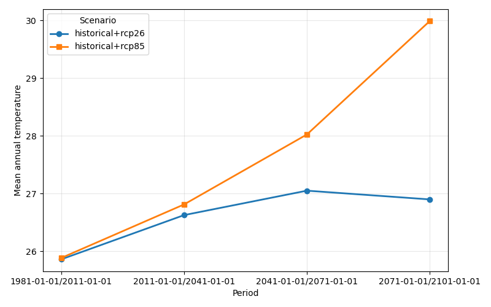
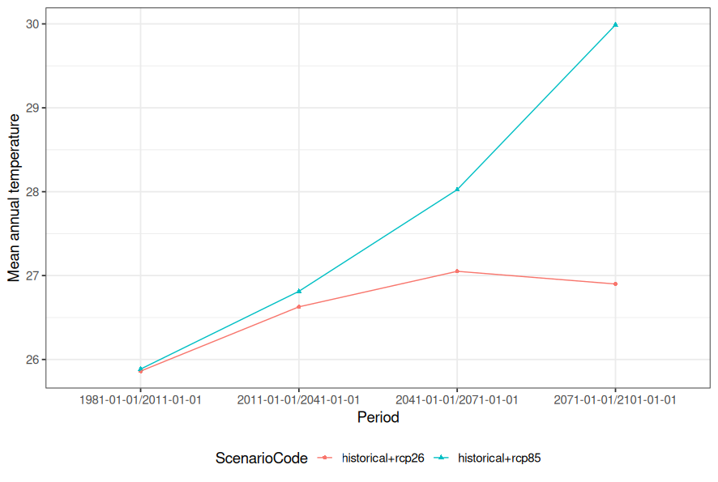

# Tutorial 2 – Exploring and using KAPy outputs

## Goal

To understand the main types of output produced by KAPy and learn how to explore and extract KAPy results using common tools in Python and R.

## What are we going to do?

In this tutorial we will explore the results produced by a KAPy workflow. We will:

1. Explore the gridded data produced by KAPy.
2. Explore the SQLite database containing areal results.
3. Extract results from the database using Python.
4. Extract and plot the same results using R.

The examples use the results from Tutorial 1, but the approach can be adapted to other KAPy projects.

## Before you start

This tutorial assumes that you have completed [Tutorial 1](./Tutorial_1.md) and have a completed KAPy analysis in your project directory.

The exact files and database contents produced by KAPy depend on the configuration of your project and the indicators you have selected. The examples below therefore focus on the general structure of KAPy outputs.

## Understanding KAPy outputs

KAPy produces two broad types of output:

1. **Gridded data** – indicator values calculated for individual grid cells.
2. **Areal data** – indicator values summarised over a defined area, such as a country, municipality or watershed.

These two types of data are stored and accessed differently.

### Gridded data

Gridded indicators are stored as NetCDF files. Depending on the workflow configuration, KAPy can produce gridded data for individual ensemble members as well as ensemble statistics.

The main output directories are:

| Directory                | Contents                                           |
| ------------------------ | -------------------------------------------------- |
| `05.indicators`          | Indicators calculated on the native grid           |
| `06.regrid`              | Indicators regridded to a common grid defined in the configuration             |
| `07.ensemble_statistics` | Ensemble statistics calculated from indicator data |

The NetCDF files can be inspected using a range of tools. For a quick look at the contents of a file, KAPy includes [`ncview`](https://cirrus.ucsd.edu/~pierce/ncview_home_page.html) in its Conda environment.

### Areal data

Areal data are indicator values summarised over a defined geographical area.

There are two different types of areal statistics that KAPy can produce:

* **Member areal statistics** – statistics calculated separately for each individual ensemble member.
* **Ensemble areal statistics** – statistics calculated across the ensemble members.

These can be enabled or disabled independently through the `areal_statistics` section of the configuration:

```yaml
areal_statistics:
    ensemble_areal_statistics: True
    member_areal_statistics: False
```

For example, the configuration above produces ensemble-level areal statistics but does not calculate member-level areal statistics. Turning off member areal statistics can be useful when they are not needed, as it avoids processing and storing additional data.

KAPy initially produces areal results as intermediate files, but collects these results into an SQLite database as part of the workflow. This provides a convenient way of working with the results from the complete analysis.

### Why SQLite?

[SQLite](https://www.sqlite.org/) is a lightweight, self-contained database system. Unlike a traditional database server, an SQLite database is simply a file on disk, so no database server needs to be installed or configured.

This makes it convenient for KAPy: the database can simply travel together with the results of an analysis.

The database also means that you can query exactly the results you need without having to read every intermediate file.

## Exploring gridded data

Let's start by looking at the gridded results.

The directories described above contain NetCDF files with the calculated indicators. You can use `ncview` to inspect one of these files:

```bash
ncview outputs/05.indicators/<filename>.nc
```

`ncview` provides a quick way to inspect the variables, dimensions and values in a NetCDF file. It is particularly useful for getting a first impression of the spatial structure of the data.

For more detailed analysis, the NetCDF files can of course be loaded directly into Python, R or other software.

## Exploring the KAPy database

The SQLite database contains the areal results from the analysis.

You can inspect the database using a graphical tool such as [sqlitebrowser](https://sqlitebrowser.org/). This is optional, but can be very useful when first becoming familiar with the structure of the database.

Open the database from the root of your KAPy project:

```bash
sqlitebrowser outputs/KAPy_database.sqlite
```

> **Note:** Use the SQLite database generated in your `outputs` directory.

### Tables and keys

Open the **Database Structure** tab in DB Browser for SQLite.

You will see a number of tables, indices and views. The tables contain the underlying data and metadata used by KAPy.

KAPy avoids repeatedly storing long descriptive strings by representing many pieces of metadata using numeric or short character keys. Separate tables are then used to translate these keys into descriptions.

For example, an areal statistics table may contain a `SeasonKey` rather than storing the description of the season in every row.

You can inspect the corresponding `Seasons` table to see what the different keys represent. In the example data, `SeasonKey = 5` represents an annual value.

### Views

KAPy also creates **views** within its database. A view is essentially a predefined query that combines information from several tables and presents it in a more convenient form.

This means that you normally do not need to work directly with all of the underlying tables.

In DB Browser for SQLite, select the **Browse Data** tab. You can start by looking at the `Configuration` table and then switch to:

```text
view_EnsembleArealStatistics
```

The view combines the numerical keys with their corresponding codes and descriptions, making the data much easier to work with.

For example, instead of having to look up the meaning of a numerical season or scenario key, the view provides fields such as:

* `SeasonCode`
* `ScenarioCode`
* `IndicatorCode`
* `TimeBinCode`
* `StatisticTypeCode`

The database also contains the `view_GriddedFiles` view, which provides information about the gridded indicator files associated with the analysis. File paths are stored relative to the location of the SQLite database.

If member-level areal statistics have been enabled, the database also contains the `view_MemberArealStatistics` view.

## Loading and plotting data in Python

Python provides a straightforward way to extract data from the KAPy database and analyse or plot it.

The basic workflow is:

1. Connect to the database.
2. Query the view containing the data.
3. Bring the selected results into a pandas DataFrame.
4. Inspect and plot the data.

### Connecting to the database

The standard Python library contains the `sqlite3` module for working with SQLite databases. We can combine this with pandas for data analysis and matplotlib for plotting:

```python
import sqlite3

import pandas as pd
import matplotlib.pyplot as plt
```

Connect to the KAPy database:

```python
conn = sqlite3.connect("outputs/KAPy_database.sqlite")
```

### Querying the data

The database may contain results for many indicators, scenarios, periods and statistics. Rather than loading everything into Python, we can use SQL to ask the database for exactly the results we want.

For example:

```python
query = """
SELECT *
FROM View_EnsembleArealStatistics
WHERE IndicatorCode = '101'
  AND SeasonCode = 'ann'
  AND StatisticTypeCode = 'mean'
  AND Percentile = 50
  AND Delta = 0
"""

temp = pd.read_sql(query, conn)

conn.close()
```

The different conditions in the query select a specific set of results:

| Query condition              | Meaning                                  |
| ---------------------------- | ---------------------------------------- |
| `IndicatorCode = '101'`      | Indicator 101: Annual mean temperature                  |
| `SeasonCode = 'ann'`         | Annual                                   |
| `StatisticTypeCode = 'mean'` | Mean over the selected area              |
| `Percentile = 50`            | 50th percentile (median) of the ensemble |
| `Delta = 0`                  | Absolute value rather than change        |

The important point here is that **the area statistic and the ensemble statistic are two different things**.

In this example, `Percentile = 50` selects the median value across the ensemble members.`StatisticTypeCode = 'mean'` means that the value (of the 50th percentile) has been averaged over the geographical area. 

For a small database you can also load an entire view:

```python
temp = pd.read_sql(
    "SELECT * FROM View_EnsembleArealStatistics",
    conn,
)
```

However, for larger analyses it is generally preferable to filter the data in the database before loading it into Python.

### Plotting the results

We can now plot the results using matplotlib.

The following example groups the data by scenario and plots each scenario as a separate line:

```python
fig, ax = plt.subplots(figsize=(8, 5))

markers = ["o", "s", "^", "D", "v", "P", "X"]

for marker, (scenario, df) in zip(
    markers,
    temp.groupby("ScenarioCode"),
):
    ax.plot(
        df["TimeBinCode"],
        df["Value"],
        marker=marker,
        linewidth=2,
        label=scenario,
    )

ax.set_xlabel("Period")
ax.set_ylabel("Mean annual temperature")
ax.grid(True, alpha=0.3)
ax.legend(title="Scenario")

plt.tight_layout()
plt.show()
```

The result should look something like this:



The `groupby()` operation separates the data into one group for each scenario. The loop then plots each scenario separately.

The complete example is available as [`Visualisation.py`](Visualisation.py).

**Ka pai!** You have now extracted KAPy results from the database and plotted them in Python.

## Loading and plotting data in R

If you are more comfortable working in R, you can access the same KAPy database directly from R.

The combination of **DBI**, **RSQLite** and **dbplyr** provides a convenient way to work with SQLite databases using familiar `dplyr` syntax.

### Connecting to the database

Load the required packages:

```r
library(DBI)
library(RSQLite)
library(dplyr)
library(dbplyr)
```

Connect to the KAPy database:

```r
db <- dbConnect(
  SQLite(),
  "outputs/KAPy_database.sqlite"
)
```

We can then connect to the KAPy view using `tbl()`:

```r
dat <- tbl(
  db,
  "View_EnsembleArealStatistics"
)
```

If you print `dat`, R will show information about the database table rather than immediately loading all of the data into memory.

This is because **dbplyr uses lazy evaluation**. It translates familiar `dplyr` operations into SQL and lets the database do the work.

### Filtering the data

We can use the same filtering conditions as in the Python example:

```r
temp <-
  dat %>%
  filter(
    IndicatorCode == "101",
    SeasonCode == "ann",
    StatisticTypeCode == "mean",
    Percentile == 50,
    Delta == 0
  ) %>%
  collect()
```

The `filter()` operation is translated into an SQL query and executed by SQLite.

The `collect()` function is important: it tells R to actually retrieve the selected results from the database and return them as a regular R data frame.

You can now inspect the data with:

```r
glimpse(temp)
```

At this point the data are in R and can be analysed using the normal tidyverse workflow.

### Plotting the results

We can use `ggplot2` to create the same plot as in the Python example:

```r
temp %>%
  ggplot(
    aes(
      x = TimeBinCode,
      y = Value,
      colour = ScenarioCode,
      shape = ScenarioCode,
      group = ScenarioCode
    )
  ) +
  geom_point() +
  geom_line() +
  theme_bw(base_size = 14) +
  theme(legend.position = "bottom") +
  labs(
    x = "Period",
    y = "Mean annual temperature"
  )
```

The result should look something like this:



The complete example is available as [`Visualisation.r`](Visualisation.r).

**Ka pai!** You have now extracted and plotted KAPy results using R.

## Next steps

You have now seen the main ways in which KAPy results are organised:

* **Gridded data** are stored as NetCDF files and can be explored or analysed using tools such as `ncview`, Python or R.
* **Areal data** are collected in an SQLite database.
* The database contains both underlying tables and more convenient views.
* Python can access the database using `sqlite3` and pandas.
* R can access it using DBI, RSQLite and dbplyr.

The examples in this tutorial only scratch the surface of what you can do with the KAPy outputs. Once you are familiar with the structure of the data, you can use your preferred analysis tools to create maps, time series, tables and other visualisations.
