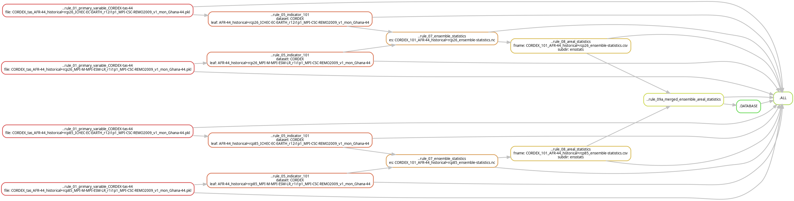

# Tutorial 3 – Workflow control

## Goal

To familiarise yourself with Snakemake and how the concepts of workflow control are implemented in KAPy.

## What are we going to do?

This tutorial explores the results of [Tutorial 1](../tutorial01/Tutorial01.md) to demonstrate some of the key features of KAPy and Snakemake.

## Before you start

This tutorial assumes that you have completed [Tutorial 1](../tutorial01/Tutorial01.md) and have a completed KAPy analysis in your project directory.

## Instructions

1. In Tutorial 1, you performed a complete run of a KAPy pipeline, starting from a fresh installation. You can get an overview of the files that have been created using:

   ```bash
   ls ./outputs/*
   ```

2. The status of the KAPy pipeline is managed by a Python tool called **Snakemake**, which will be the focus of this tutorial.

   Snakemake is conceptually similar to **GNU Make**, if you're familiar with it. The main difference is that Snakemake is implemented in Python, allowing the full power of the Python language to be used when describing a workflow.

   Both tools work by creating a conceptual model of the files in a workflow, together with the relationships and dependencies between them. This model can be represented as a **Directed Acyclic Graph** (DAG for short).

   The **Snakefile** defines the workflow: what files can be produced and how they depend on one another. The files currently present on disk represent the current state of the workflow. Snakemake compares these two to determine what needs to be done.

   In Snakemake, the workflow is described using a series of **rules**. These rules are specified in the `Snakefile` found in `./KAPy/workflow/Snakefile`. Open it in a text editor and have a look at it.

   A second `Snakefile` exists in `./Snakefile`. This loads the KAPy workflow and provides the entry point when you run Snakemake from your project directory.

   You don't need to worry about understanding the Snakefile in detail, and in most use cases you won't need to edit it. However, it is useful to know that it is there and that it defines how Snakemake processes your data.

3. Snakemake provides a series of **targets** that can be built individually, or chained together into a coherent pipeline. You can get a list of the available targets with:

   ```bash
   snakemake -l
   ```

   Compare the names listed here with the targets and rules you see in the Snakefile. They are largely the same because the targets are defined by the workflow.

   There is an important logic to the naming of the rules:

   * Rules starting with `..` are internal, generic rules that are used to process multiple files. They are not intended to be called directly by the user.

   * Rules starting with `.` are target-like rules that represent collections of files to be created.

   * Rules that don't start with `.` correspond to `id` values in the tabular configuration files. Calling one of these targets runs the configuration associated with that `id`.

   This naming convention provides a convenient way of exposing the parts of the KAPy workflow that you are likely to want to run, while keeping the underlying processing rules internal to the workflow.

4. Snakemake also has a handy visualisation tool that lets you examine the workflow as a DAG.

   The `dot` program used to create the image is part of the **Graphviz** package. If it is not already installed, you can install it using your operating system's package manager. 

   Now try running the following command, and then open `dag.png` in a graphics viewer or browser:

   ```bash
   snakemake --dag | tail -n +2 | dot -Tpng -Grankdir=LR > dag.png
   ```

   The `tail -n +2` removes the first line of Snakemake's output, leaving the Graphviz input that `dot` expects.

   The DAG created looks like this:

   

   You can see the basic workflow of the pipeline, starting on the left with the primary variables created by `..rule01`, progressing through the indicator calculation in `..rule05`, then to the ensemble statistics (`..rule07`), the areal statistics (`..rule08`), and finally the output `.DATABASE`.

5. OK, let's do something a bit more concrete. A natural next step is to run the pipeline again:

   ```bash
   snakemake --cores 1
   ```

   **What do you think is going to happen?**

6. **Answer:** Nothing!

   Snakemake should report something similar to:

   ```text
   Nothing to be done (all requested files are present and up to date).
   ```

   This may be surprising if you are thinking about KAPy as a classical script. On the other hand, if you are thinking about it as a form of GNU Make, you may have guessed the answer.

   Snakemake examines the workflow defined in the Snakefile and compares it with the current state of the files on disk. Because all the required output files are present and Snakemake determines that they are up to date, there is nothing to do.

   This is one of the key advantages of using a workflow manager: **you don't have to rerun the entire analysis every time you run KAPy.**

7. Let's say that something does need to be done. Perhaps, for example, we accidentally deleted a file in the middle of the pipeline.

   Let's remove an individual indicator file:

   ```bash
   rm outputs/05.indicators/101/CORDEX_101_AFR-44_historical+rcp26_MPI-M-MPI-ESM-LR_r1i1p1_MPI-CSC-REMO2009_v1_mon_Ghana-44.nc
   ```

8. **What do you think will happen when we run Snakemake now?**

   Take a moment to form a hypothesis before continuing.

9. Rather than actually running the pipeline, we can ask Snakemake what it *would* do using a **dry-run**:

   ```bash
   snakemake -n
   ```

   The `-n` option tells Snakemake to work out what needs to be done without actually executing the jobs.

   Snakemake does not know or care why the file is missing. It sees that an expected output is absent and follows the dependency graph to determine what needs to be rebuilt.

10. **Answer:** Snakemake identifies that the missing indicator file needs to be recreated.

    However, this also affects files further downstream in the workflow. Recreating the missing file changes the state of the workflow, and Snakemake can therefore determine that downstream outputs depending on it may no longer be up to date.

    As a result, the necessary downstream parts of the workflow are also scheduled for rebuilding — in this case including the ensemble statistics and areal statistics.

    This is the important part: **Snakemake does not simply rerun the whole KAPy pipeline. It identifies the part of the dependency graph that needs to be rebuilt.**

11. Now run the pipeline to completion:

    ```bash
    snakemake --cores 1
    ```

    Snakemake will recreate the missing file and then update the necessary downstream outputs.

12. The concepts of workflow management are fundamental to understanding KAPy and many of its strengths.

    You probably won't need to manage or edit the workflow during normal KAPy usage — the workflow is largely controlled automatically as a result of the KAPy configuration. Nevertheless, it is useful to have an idea of what is happening behind the scenes.

    You have now seen how KAPy uses Snakemake to:

    * describe the relationships between different stages of an analysis;

    * determine which parts of a workflow need to be run;

    * avoid unnecessary processing when outputs are already up to date;

    * recover from missing intermediate files; and

    * rebuild only the parts of the workflow affected by a change.

**Ka pai!**
