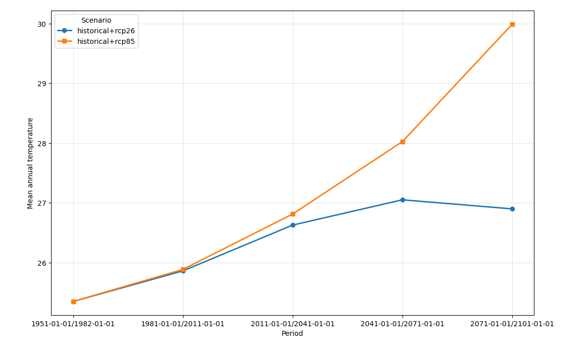

# Tutorial 4 – Time-binning and seasons

## Goal

To understand how time periods and seasons are defined in KAPy and how changing these definitions affects the workflow and its outputs.

## What are we going to do?

In this tutorial we will modify the time periods and seasons used by KAPy, rerun the pipeline, and explore how these changes affect the workflow and its outputs.

## Before you start

This tutorial assumes that you have completed [Tutorial 1](../tutorial01/Tutorial01.md) and have a completed KAPy analysis in your project directory.

A full set of configuration files for this tutorial can be found in `./docs/tutorials/tutorial04/` if you don't wish to create them yourself.

## Instructions

1. In Tutorial 1, you performed a complete run of a KAPy pipeline, starting from a fresh installation. This configuration calculated a single indicator as an average over 30-year periods.

   In this tutorial we will modify the configuration to calculate the same indicator with a different time and seasonal resolution.

   Indicators in KAPy are calculated by applying a statistic (for example, mean or maximum) over a defined time bin. A time bin is formed from a **time period** and a **season**. For example, an annual mean for 1981–2010 uses all months from 1981 through 2010, while a summer mean for the same period uses only June, July and August.

2. KAPy uses configuration tables to define the periods and seasons over which indicators are calculated. The two key configuration files are `config/seasons.tsv` and `config/periods.tsv`.

   We'll start by opening the seasons configuration file in a spreadsheet. You'll see something like this:

   | id  | enabled | description         | months                     |
   | --- | ------- | ------------------- | -------------------------- |
   | ann | x       | Annual              | 1,2,3,4,5,6,7,8,9,10,11,12 |
   | JJA | x       | Boreal summer (JJA) | 6,7,8                      |
   | SON | x       | Boreal autumn (SON) | 9,10,11                    |
   | DJF | x       | Boreal winter (DJF) | 12,1,2                     |
   | MAM | x       | Boreal spring (MAM) | 3,4,5                      |

   The most important columns are the `id` and `months` columns. The `id` column identifies the season and is used by KAPy when referring to it. The `months` column defines which months are included in the season.

   The `enabled` column controls whether the season is included in the current analysis. If the column is empty, the season is not calculated, but it is retained in the configuration file in case you want to enable it again.

   The `description` column can be used to provide a more detailed description of the season, but does not influence the processing directly.

   Seasons are independent of each other, so they can overlap. For example, `ann` includes all months, while `JJA` includes June, July and August.

3. For this example, we will add a new season corresponding to the first half of the year. Make the following changes to the file:

   * Add a new season with `id` `1stHalf` and months 1–6.
   * Disable the other seasons, except `ann`, by removing the `enabled` tick.

   You should end up with something that looks like this:

   | id      | enabled | description            | months                     |
   | ------- | ------- | ---------------------- | -------------------------- |
   | ann     | x       | Annual                 | 1,2,3,4,5,6,7,8,9,10,11,12 |
   | JJA     |         | Boreal summer (JJA)    | 6,7,8                      |
   | SON     |         | Boreal autumn (SON)    | 9,10,11                    |
   | DJF     |         | Boreal winter (DJF)    | 12,1,2                     |
   | MAM     |         | Boreal spring (MAM)    | 3,4,5                      |
   | 1stHalf | x       | First half of the year | 1,2,3,4,5,6                |

4. Time periods are defined in `./config/periods.tsv`. Open this file, which looks like this:

   | enabled | description                  | start | end  |
   | ------- | ---------------------------- | ----- | ---- |
   | x       | Historical (1981-2010)       | 1981  | 2010 |
   | x       | Start-of-century (2011-2040) | 2011  | 2040 |
   | x       | Mid-century (2041-2070)      | 2041  | 2070 |
   | x       | End-of-century (2071-2100)   | 2071  | 2100 |

   The `enabled` and `description` columns here have the same meaning as in the seasons configuration file.

   The `start` and `end` columns define the first and last year of the time period and are inclusive. For example, the first period includes all data from the beginning of 1981 through the end of 2010.

   KAPy handles differences between climate model calendar systems automatically, so the last day of a year does not necessarily have to be 31 December.

   Reading this configuration shows that KAPy is configured to calculate four 30-year periods.

5. Let's add a new time period. Time periods can have different lengths and can overlap; they do not need to form a continuous sequence.

   The CORDEX sample data actually goes back to 1950, so we can add a period from 1951 to 1980. Add a new row to the table and configure the new period.

   You should end up with something that looks like this:

   | enabled | description                  | start | end  |
   | ------- | ---------------------------- | ----- | ---- |
   | x       | Pre-Historical (1951-1980)   | 1951  | 1980 |
   | x       | Historical (1981-2010)       | 1981  | 2010 |
   | x       | Start-of-century (2011-2040) | 2011  | 2040 |
   | x       | Mid-century (2041-2070)      | 2041  | 2070 |
   | x       | End-of-century (2071-2100)   | 2071  | 2100 |

6. So now we are ready to go. Before running the workflow, let's use what we learned in Tutorial 3 and ask Snakemake what it thinks needs to be done.

   Do a dry-run to check:

   ```bash
   snakemake -n
   ```

   You should see a summary that looks something like this:

   ```text
   Job stats:

   job                                            count
   -------------------------------------------  -------
   ..rule_05_indicator_101                            4
   ..rule_07_ensemble_statistics                      2
   ..rule_08_areal_statistics                         2
   ..rule_09a_merged_ensemble_areal_statistics        1
   .DATABASE                                          1
   .ALL                                               1
   total                                              11
   ```

   We can see that Snakemake wants to rerun the indicator calculation and downstream rules, reflecting the changed definition of the time periods and seasons.

   The data import phase, `..rule_01_xxx`, does not need to be rerun because the required input data are already present.

   Once again, Snakemake is doing the work of figuring out exactly what needs to be recalculated.

7. Make it so.

   ```bash
   snakemake --cores 1
   ```

8. Once the output has been completed, we can explore the contents of the database. Use sqlitebrowser to open the database:

   ```bash
   sqlitebrowser outputs/KAPy_database.sqlite
   ```

   You'll see that the `Seasons` table now contains only two entries: `ann` and `1stHalf`. The other seasons are still present in `seasons.tsv`, but because they are disabled they are not included in the active configuration and don't produce any results.

   The `TimeBins` table now contains five time periods: the four original periods plus the new 1951–1980 period.

   Note also the way that the time periods are represented in the database, for example:

   ```text
   1951-01-01/1982-01-01
   ```

   This representation follows the ISO 8601 half-openinterval convention, where the left-hand side is the start of the period and is inclusive, while the right-hand side is the end of the period and is exclusive.

9. Switch to the `view_EnsembleArealStatistics` view. You should be able to see in the `SeasonCode` field that there are now both `ann` and `1stHalf` seasons.

10. We can plot the results using the Python plotting script from [Tutorial 2](../tutorial02/Tutorial02.md).

    ```bash
    python KAPy/docs/tutorials/tutorial02/Visualisation.py
    ```

    You should get a plot that looks like this:

    

    Compare this with the plot from [Tutorial 2](../tutorial02/Python_plot.png). You should now see both the additional time period and the additional `1stHalf` season represented in the results.

11. That concludes this tutorial.

    You have now seen how the time periods and seasons in KAPy are defined through configuration tables, and how changing those definitions causes Snakemake to identify and rebuild the affected parts of the workflow.

    The same approach can be used to customise the temporal resolution of a KAPy analysis to suit the needs of a particular application.

    **Ka pai!**
