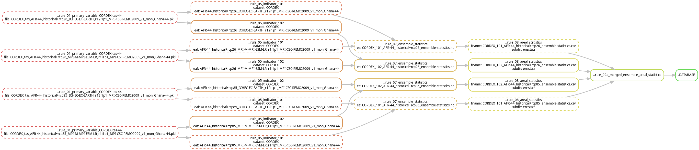
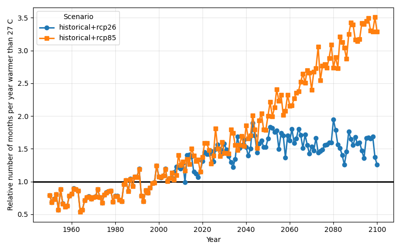

# Tutorial 5 - Adding a new indicator

## Goal

To learn how indicators are configured in KAPy and how a new indicator can be added to an existing analysis.

## What are we going to do?

In this tutorial we will define a new indicator and rerun the KAPy pipeline.

The new indicator will calculate the **number of months per year where the monthly mean temperature is 27 °C or higher**. Unlike the indicator used in previous tutorials, this indicator will be calculated at annual resolution rather than being aggregated over 30-year periods.

This will also introduce several of the options available in the indicator configuration, including different statistics, time-binning, seasons, additional arguments, and relative changes.

## Before you start

This tutorial assumes that you have completed [Tutorial 1](../tutorial01/Tutorial01.md) and have a completed KAPy analysis in your project directory. It can also build on other tutorials prior to this oneif you prefer to continue from there.

A full set of configuration files for this tutorial can be found in `./docs/tutorials/tutorial05/` if you don't wish to create them yourself.

## Instructions

1. In Tutorial 1, you performed a complete run of a KAPy pipeline, starting from a fresh installation. This configuration calculated a single indicator: the mean temperature over 30-year periods.

   Here we will add a second indicator to the configuration and rerun the analysis.

   The two indicators use the same underlying temperature data, but apply different calculations:

   | Indicator | Statistic | Time binning     | Result                                   |
   | --------- | --------- | ---------------- | ---------------------------------------- |
   | `101`     | `mean`    | 30-year periods  | Mean temperature over each period        |
   | `102`     | `count`   | Individual years | Number of months with temperature ≥27 °C |

   This illustrates how the indicator configuration determines what is calculated from the input data.

2. Start by getting an overview of the files present in the current version of the pipeline. In particular, note that the `./outputs/05.indicators` folder currently only contains one set of indicators, `101`:

   ```bash
   ls ./outputs/05.indicators/*
   ```

3. Indicators are defined and configured via `./config/indicators.tsv`. The `.tsv` (tab-separated values) format can be edited using a text editor, if you take care to ensure that the tab separators are maintained between each entry. However, we highly recommend using a spreadsheet programme, such as LibreOffice or Excel.

   Open `./config/indicators.tsv` in your spreadsheet programme and modify it to look like the following. Save the file.

   |  `id` | `indicator_codes` | `enabled` | `description`              | `variables` | `datasets` | `seasons` | `time_binning` | `statistic` | `skipna` | `delta_type` | `additional_arguments`         | `custom_script` | `custom_function` |
   | ----: | ----------------: | :-------: | -------------------------- | ----------- | ---------- | --------- | -------------- | ----------- | -------- | ------------ | ------------------------------ | --------------- | ----------------- |
   | `101` |             `101` |    `x`    | `Annual mean temperature`  | `tas`       | `all`      | `all`     | `periods`      | `mean`      | `false`  | `subtract`   | `{}`                           |                 |                   |
   | `102` |             `102` |    `x`    | `Number of months over 27` | `tas`       | `all`      | `ann`     | `years`        | `count`     | `false`  | `divide`     | `{'threshold':'27','op':'ge'}` |                 |                   |

   For a description of the configuration options, see the [indicator table](../../configuration/indicators.md) documentation.

   In this new configuration, indicator `102` introduces several new features:

   * **Statistic:** Rather than calculating the mean temperature, we calculate the number of months with a monthly mean temperature of 27 °C or higher. We achieve this by changing the `statistic` parameter from `mean` to `count`.

     We also need to provide `additional_arguments` as a Python dictionary to specify the threshold and the logical operator (`op`):

     ```text
     {'threshold':'27','op':'ge'}
     ```

     Here, `threshold` specifies the temperature threshold, while `op` specifies the comparison. `ge` means "greater than or equal to", so together these arguments tell KAPy to count values that are ≥27 °C.

   * **Time binning:** Rather than calculating `102` over a 30-year period, we choose to calculate it for each year by changing the `time_binning` parameter from `periods` to `years`.

   * **Season:** As `102` is the annual number of months over 27 °C, it does not make sense to calculate the indicator separately for individual seasons. Instead, we choose the `ann` season, which contains all 12 months, by changing the `seasons` parameter from `all` to `ann`.

     The value `all` means that all enabled seasons are used, whereas `ann` specifically selects the annual season. Multiple seasons can be specified as a comma-separated list.

   * **Delta type:** We indicate that we want to express the indicator relative to the reference value rather than as an absolute difference by changing `delta_type` from `subtract` to `divide`.

     With `subtract`, KAPy calculates a difference between the value and the reference value. With `divide`, the result is expressed as a ratio of the value to the reference value.

4. So now we are ready to go. First, let's see how Snakemake responds to this new configuration.

   ```bash
   snakemake -n
   ```

   We can see that Snakemake wants to run the new rule `..rule_05_indicator_102` for the new output files associated with indicator `102`.

   There is no corresponding job for indicator `101`, as its outputs have already been created in previous tutorials. Snakemake compares the requested outputs with the files that already exist and only schedules the parts of the workflow whose outputs need to be created or updated.

5. We can also review the revised DAG with indicator `102` incorporated. Create the DAG as previously:

   ```bash
   snakemake .DATABASE --dag | tail -n +2 | dot -Tpng -Grankdir=LR > dag_tutorial05.png
   ```

   You'll get a figure like this:

   

   There are a couple of things to note here.

   Firstly, the same input data can now be used by two different indicator calculations: one for `101` and one for `102`. Indicator `102` is therefore derived from the same input temperature data as indicator `101`, but with a different configuration.

   Note also the borders around the files. A dashed line means that the corresponding output does not need to be recreated, whereas a solid line means that the output either does not exist or needs to be recreated to reflect the updated configuration.

6. Make it so.

   ```bash
   snakemake --cores 1
   ```

7. Use a similar approach to that used previously to explore the results. In particular, open one of the ensemble statistics NetCDF files for indicator `102` using Ncview:

   ```bash
   ncview outputs/07.ensemble_statistics/CORDEX_102_AFR-44_historical+rcp85_ensemble-statistics.nc
   ```

   You'll see that the time axis now contains individual years rather than 30-year periods.

   Similarly, if you open the database using SQLite Browser, you'll see that the `TimeBins` table now contains `TimeBinCodes` corresponding to both one-year and 30-year periods. This reflects the different time aggregations used by the two indicators.

8. A [plotting script](Tutorial05_plot.py) is available in the tutorial folder and can be used to make the following figure:

   

   The y-axis shows the ratio of the indicator value in a given year to the reference value for the indicator.

   The reference period throughout a KAPy configuration is defined as the first period in the `periods` table. In this case, the reference period is 1981–2010.

   Although indicator `102` is calculated separately for each year, the reference value is based on the reference period. The plotted values therefore show how the annual number of months with a monthly mean temperature of 27 °C or higher compares with the reference-period value.

9. That concludes this tutorial.

   You have now seen how a new indicator can be added to a KAPy analysis without recalculating existing indicators. You have also seen how the `statistic`, `time_binning`, `seasons`, `additional_arguments`, and `delta_type` options can be combined to define a new indicator.

   KAPy includes several built-in indicator statistics, as well as the ability to define custom indicators using user-defined functions. See the [indicator table](../../configuration/indicators.md) documentation for more information.

**Ka pai!**
