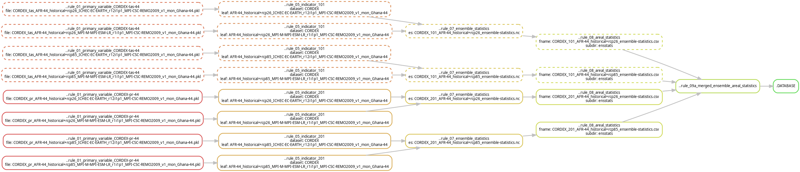
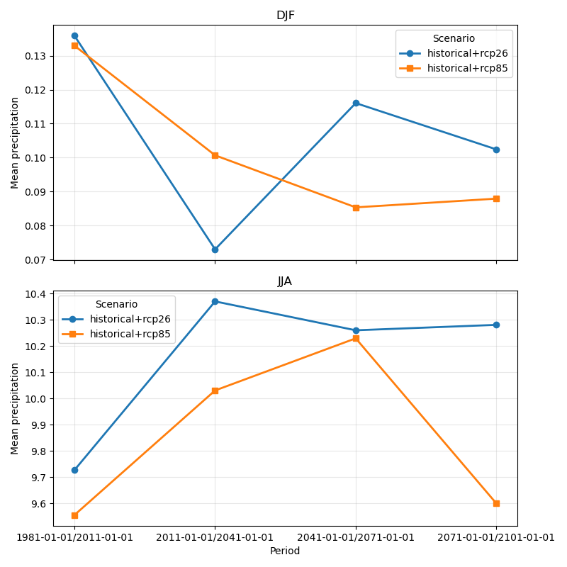

# Tutorial 6 - Adding a new data source

## Goal

To learn how new input data sources are configured in `KAPy`.

## What are we going to do?

In this tutorial we will add precipitation data from CORDEX as a new data source. We will then add an indicator that uses this new dataset to calculate mean precipitation for the configured time periods.

This tutorial also introduces the use of file lists to define input data sources, rather than relying on file name patterns.

## Before you start

This tutorial assumes that you have completed [Tutorial 1](../tutorial01/Tutorial01.md) and have a completed KAPy analysis in your project directory. It can also build on other tutorials prior to this one if you prefer to continue from there.

A full set of configuration files for this tutorial can be found in `./docs/tutorials/tutorial06/` if you don't wish to create them yourself.

## Instructions

1. In Tutorial 1, you performed a complete run of a `KAPy` pipeline, starting from a fresh installation. This configuration only used data from a single climate variable (`tas`), whereas in a real setting we will want to work with more than one variable.

   Here we will add precipitation to the original `tas` dataset, and then define a new indicator to make use of it.

2. First, we need to get some more data. Download the [precipitation data](https://download.dmi.dk/Research_Projects/KAPy/pr_example_dataset.zip) for the same Ghana domain into a temporary directory, copy the `.zip` file into `./inputs/` and unzip it there.

   Check the contents of this directory - you should see files starting with both `tas_*` and `pr_*` now.

   ```bash
   ls inputs/*
   ```

3. Input data sources are defined via the input configuration table `./config/inputs.tsv`. Open this file in a spreadsheet (e.g. LibreOffice). Each row defines an input data source.

   You should be able to identify the existing CORDEX `tas` input:

   | `id`            | `enabled` | `dataset_code` | `variable_code` | `units` | `grid_code` | `path`                           | `internal_variable_name` | `custom_script` | `custom_function` | `checks` | `rechunking_strategy` | `merge_files` | `field_separator` | `experiment_field` | `common_experiment` | `member_id_fields` |
   | --------------- | :-------: | -------------- | --------------- | ------- | ----------- | -------------------------------- | ------------------------ | --------------- | ----------------- | :------: | --------------------- | :-----------: | ----------------- | :----------------: | ------------------- | ------------------ |
   | `CORDEX-tas-44` |    `x`    | `CORDEX`       | `tas`           | `degC`  | `AFR-44`    | `inputs/tas_Ghana-44_*REMO2009*` | `tas`                    |                 |                   |   `all`  | `none`                |     `true`    | `_`               |         `4`        | `historical`        | `3,5,6,7,8,2`      |

4. KAPy allows input data sources to be defined in a variety of ways. The quickest and easiest way is to use a glob, as can be seen in the `path` field above:

   ```text
   inputs/tas_Ghana-44_*REMO2009*
   ```

   However, this is not the most robust way of defining input data sources, as it only picks up the files that are available in the specified directory. A more robust way of defining input data sources is to make a list of files that should be used.

   A file list has two advantages. Firstly, if a file expected by the file list is missing, the KAPy workflow will report an error rather than simply processing the files that happen to be present. Secondly, it allows for the list of files used to be tracked in, for example, version control.

   A file list can be generated in many ways, including by hand. Here we will use the `ls` command to list the files in the directory, and then pipe the output into a text file. Run the following command:

   ```bash
   ls inputs/pr_Ghana-44_*REMO2009* > config/pr_Ghana-44_files.txt
   ```

   This will create a file called `pr_Ghana-44_files.txt` in the `config` directory - where you store it is up to you.

   Now view the contents of this file:

   ```bash
   less config/pr_Ghana-44_files.txt
   ```

   You should see a list of files that look like this:

   ```text
   inputs/pr_Ghana-44_ICHEC-EC-EARTH_historical_r12i1p1_MPI-CSC-REMO2009_v1_mon_195001_195012.nc
   inputs/pr_Ghana-44_ICHEC-EC-EARTH_historical_r12i1p1_MPI-CSC-REMO2009_v1_mon_195101_195512.nc
   inputs/pr_Ghana-44_ICHEC-EC-EARTH_historical_r12i1p1_MPI-CSC-REMO2009_v1_mon_195601_196012.nc
   ...
   ```

   A further advantage of the file list approach is that the list of files can be generated programmatically, for example using a Python script, allowing for quite complex selection criteria to be applied.

5. Next, we need to modify `config/inputs.tsv` to incorporate the new data input and link it to the file list.

   Open the file in a spreadsheet and add a second line so that it looks like this:

   | `id`            | `enabled` | `dataset_code` | `variable_code` | `units`  | `grid_code` | `path`                           | `internal_variable_name` | `custom_script` | `custom_function` | `checks` | `rechunking_strategy` | `merge_files` | `field_separator` | `experiment_field` | `common_experiment` | `member_id_fields` |
   | --------------- | :-------: | -------------- | --------------- | -------- | ----------- | -------------------------------- | ------------------------ | --------------- | ----------------- | :------: | --------------------- | :-----------: | ----------------- | :----------------: | ------------------- | ------------------ |
   | `CORDEX-tas-44` |    `x`    | `CORDEX`       | `tas`           | `degC`   | `AFR-44`    | `inputs/tas_Ghana-44_*REMO2009*` | `tas`                    |                 |                   |   `all`  | `none`                |     `true`    | `_`               |         `4`        | `historical`        | `3,5,6,7,8,2`      |
   | `CORDEX-pr-44`  |    `x`    | `CORDEX`       | `pr`            | `mm/day` | `AFR-44`    | `config/pr_Ghana-44_files.txt`   | `pr`                     |                 |                   |   `all`  | `none`                |     `true`    | `_`               |         `4`        | `historical`        | `3,5,6,7,8,2`      |

   Comparing the two lines, there are a few things to note.

   Firstly, the `id` field has changed from `CORDEX-tas-44` to `CORDEX-pr-44`. Each input data source must have a unique `id`.

   The `dataset_code` remains `CORDEX` because both inputs come from the same dataset. The `variable_code` changes from `tas` to `pr`, identifying precipitation as the new climate variable. The `internal_variable_name` also changes to `pr`, as this is the name of the variable within the NetCDF files.

   Most importantly, the `path` field has been changed to point to the file list we created earlier.

   Most of the other fields are unchanged between the two lines. Open the [input configuration documentation](../../configuration/inputs.md) now to get a full overview of the options available. When you're done, return to this tutorial and save the file.

6. We have now added precipitation as an input data source, but so far KAPy will not process it. **A data source only becomes part of the processing workflow when an indicator references it.**

   Following on from what we learnt in previous tutorials about adding new indicators, open `config/indicators.tsv` and add the following line:

   |  `id` | `indicator_codes` | `enabled` | `description`               | `variables` | `datasets` | `seasons` | `time_binning` | `statistic` | `skipna` | `delta_type` | `additional_arguments` | `custom_script` | `custom_function` |
   | ----: | ----------------: | :-------: | --------------------------- | ----------- | ---------- | --------- | -------------- | ----------- | -------- | ------------ | ---------------------- | --------------- | ----------------- |
   | `201` |             `201` |    `x`    | `Mean precipitation` | `pr`        | `all`      | `all`     | `periods`      | `mean`      | `false`  | `subtract`   | `{}`                   | `<br>`          | `<br>`            |

   Other indicators, e.g. from previous tutorials, can be retained.

7. So now we are ready to go. Firstly, let's see how Snakemake responds to this new configuration.

   ```bash
   snakemake -n
   ```

   The summary table will now include jobs associated with the new `CORDEX-pr-44` input and the `201` indicator. Depending on which previous tutorials you have completed, the exact job counts may differ.

   For example, starting from the state produced by Tutorial 1, you should see jobs similar to these:

   ```text
   Job stats:

   job                                            count
   -------------------------------------------  -------
   ..rule_01_primary_variable_CORDEX-pr-44            4
   ..rule_05_indicator_201                            4
   ..rule_07_ensemble_statistics                      2
   ..rule_08_areal_statistics                         2
   ..rule_09a_merged_ensemble_areal_statistics        1
   .DATABASE                                          1
   .ALL                                               1
   total                                              15
   ```

   Notice that adding the new input data source has not caused the existing `tas` processing to be repeated. Snakemake identifies the new outputs that need to be created and schedules the corresponding parts of the workflow.

8. The revised DAG is also more complicated as a result. Create the DAG as previously:

   ```bash
   snakemake .DATABASE --dag | tail -n +2 | dot -Tpng -Grankdir=LR > dag_tutorial06.png
   ```

   You'll get a figure like this:

   

   Comparing this with the previous DAGs, you can see that the DAG is substantially larger because we have added a new input data source and a new indicator.

   Note also that the `tas` and `pr` inputs are independent of each other, and only meet in the final stages of the workflow.

9. Make it so!

   ```bash
   snakemake --cores 1
   ```

10. Now explore the results as before.

11. This [plotting script](Indicator_201_plot.py) can be used to make the following figure comparing the results for the DJF and JJA seasons. Note in particular the substantial difference in precipitation between the two seasons. Since the example dataset contains only two ensemble members, the results should be regarded as illustrative rather than as a robust estimate of the full ensemble range.

    

12. That concludes this tutorial. KAPy is designed to handle multiple different data sources within the same framework. For example, applying the same processing chains to data from ERA5, CMIP5, and CMIP6 is possible within the same workflow.

**Ka pai!**
