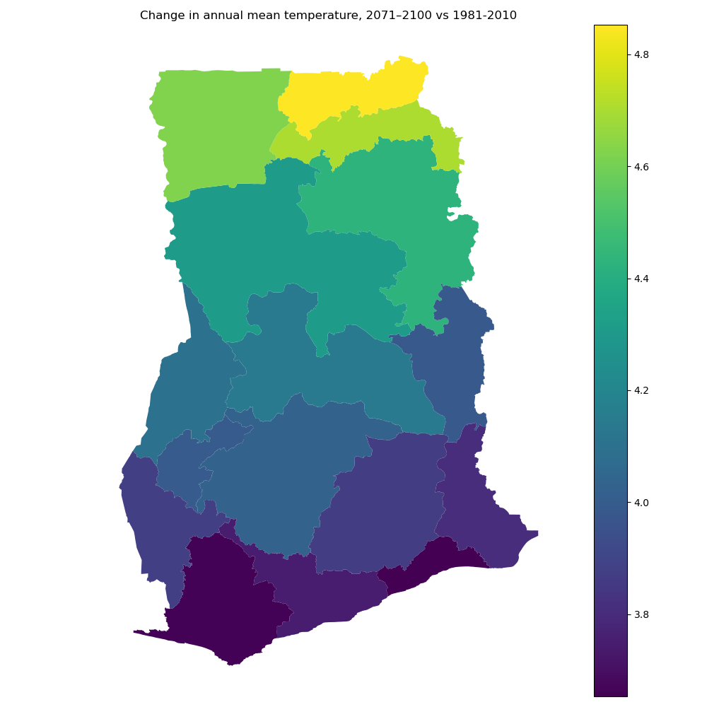

# Tutorial 7 - Using a shapefile for area statistics

## Goal

To learn how to configure a shapefile for area averaging in `KAPy`.

## What are we going to do?

In this tutorial, we will use a shapefile to calculate climate statistics over regions of interest, in this case the regions of Ghana.

The climate data are calculated on a regular grid, but in many applications we are interested in statistics for specific geographical areas. A shapefile allows us to define these areas as polygons and calculate area-averaged statistics for each one.

## Before you start

This tutorial assumes that you have completed [Tutorial 1](../tutorial01/Tutorial01.md) and have a completed KAPy analysis in your project directory. It can also build on other tutorials prior to this one if you prefer to continue from there.

A full set of configuration files for this tutorial can be found in `./docs/tutorials/tutorial07/` if you do not wish to create them yourself.

## Instructions

1. In Tutorial 1, you performed a complete run of a `KAPy` pipeline, starting from a fresh installation.

   That configuration calculates area statistics over the entire domain of the analysis. In a real setting, however, we are often interested in calculating statistics over specific geographical areas, such as municipalities, regions, drainage basins or national boundaries, as defined in a *shapefile*.

2. First, we need to define the areas of interest for our analysis using a shapefile. For the sake of this tutorial, we have included a shapefile containing the regions of Ghana. Unless you are working in Ghana, however, you will need to obtain your own shapefile.

   A shapefile is not a single file, but a collection of several files with different extensions that work together to represent the spatial data. You can see the files included with the example shapefile with:

   ```bash
   ls ./KAPy/docs/tutorials/resources/shapefiles/
   ```

   If you want to open or explore the shapefile, you will need R, Python, or a GIS application such as QGIS.

3. The shapefile is configured in `./config/config.yaml`. Open this file in a text editor (e.g. `vi`).

   The relevant options are found under the `areal_statistics` category. The `shapefile` option gives the path to the shapefile, normally by pointing to the `.shp` file. The associated shapefile components, such as the `.dbf` and `.shx` files, must also be available.

   Edit the configuration file so that the `areal_statistics` section looks like this:

   ```yaml
   areal_statistics:

       ensemble_areal_statistics: True

       member_areal_statistics: False

       use_area_weighting: False

       shapefile: "KAPy/docs/tutorials/resources/shapefiles/Ghana_regions.shp"
   ```

   If the `shapefile` option is not specified, the areal statistics will be calculated over the entire domain of the analysis.

   The other options here are also interesting. The `use_area_weighting` option controls whether the grid cells are weighted according to their area when calculating the regional statistics. The `ensemble_areal_statistics` and `member_areal_statistics` options control whether areal statistics are calculated for the ensemble statistics and individual ensemble members, respectively.

4. Now we are ready to run the workflow. First, let's see how Snakemake responds to the new configuration:

   ```bash
   snakemake -n
   ```

   KAPy will show that it needs to recalculate parts of the workflow to apply the new area definitions. In particular, the areal statistics and any outputs that depend on them will need to be regenerated.

   Now run the workflow:

   ```bash
   snakemake --cores 1
   ```

5. Now explore the results in the database using SQLite Browser:

   ```bash
   sqlitebrowser outputs/KAPy_database.sqlite
   ```

   Browse to the `Areas` table. This table was not previously populated with individual regions, but now contains an entry for each of the 16 regions in Ghana, as derived from the shapefile.

   The key columns here are:

   * `AreaKey`, which is assigned as a 0-indexed integer by KAPy;
   * `geom_wkt`, which defines each geometry using the well-known text (WKT) format; and
   * `geom_crs`, which defines the coordinate reference system used for the geometry.

   Other columns are imported from the shapefile and can vary from one analysis to another.

6. Next, browse to `View_EnsembleArealStatistics` and try to find the area information here. The only sign of the area information is the `AreaKey` column, which corresponds to the `AreaKey` column in the `Areas` table.

   There are two reasons why the rest of the `Areas` table is not visible in this view:

   * the contents of the `Areas` table can vary from one analysis to another, making it difficult to provide a consistent view across analyses;
   * the `geom_wkt` column can be quite large, particularly when it is combined with the thousands of rows that a database often contains. Early development versions of the database that included this column regularly crashed their host machine due to out-of-memory errors.

   It is therefore the user's responsibility to merge the polygons from the `Areas` table with the data contained in the view at an appropriate point, preferably after the amount of data has been reduced to a manageable size.

7. You can perform a more detailed analysis using `Python`, `R`, or your programming language of choice. An example of such an analysis using Python can be found in [this script](plot_regions.py).

   The example reads the climate statistics from `View_EnsembleArealStatistics` and the corresponding polygon geometries from the `Areas` table. The WKT geometries are converted to GeoPandas geometries and plotted according to their `Value`.

   The resulting plot is as follows:

   

   We have included the Python example in the tutorial helper files.

8. That concludes this tutorial.

**Ka pai!**
