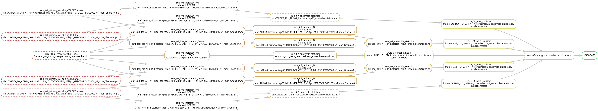
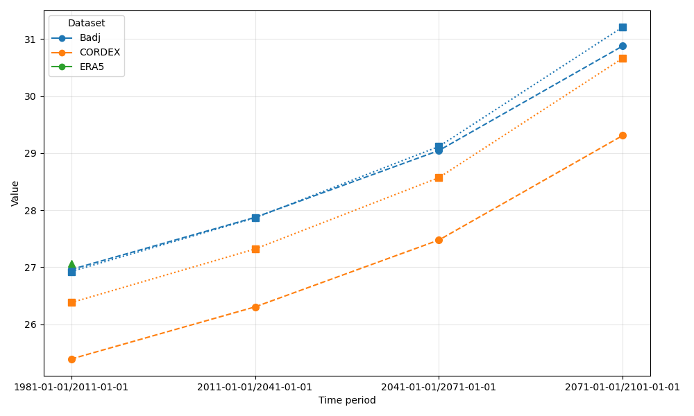

# Tutorial 8 – Implementing Bias adjustment in KAPy

## Goal

To learn how to configure and use bias adjustment in KAPy.

## What are we going to do?

In this tutorial we will configure a bias-adjustment method in KAPy. We will use simulated monthly temperature from CORDEX over Ghana for two emissions scenarios, and adjust it using ERA5 as the reference dataset.

We will then compare the original and bias-adjusted results to see how the adjustment affects the simulated temperature.

## Before you start

It is highly recommended that you start with a fresh installation of KAPy, configured with the cookiecutter to give a "simple" configuration, and with downloaded sample data.

A full set of configuration files for this tutorial can be found in `./docs/tutorials/tutorial08/` if you don't wish to create them yourself.

## Background

### What is bias adjustment?

Climate models can have systematic differences, or **biases**, compared with observations or other reference datasets. Bias adjustment is a statistical method for adjusting model data to better match a reference dataset.

In this tutorial we use the `scaling` approach provided by the [xsdba Python package](https://xsdba.readthedocs.io/en/latest/).

An adjustment is calibrated by comparing the model data with the reference data over a specified **calibration period**. The resulting adjustment is then applied to the model data.

For temperature, an **additive** adjustment is commonly appropriate because differences are naturally expressed in absolute units. For variables such as precipitation, a **multiplicative** adjustment is often more appropriate because relative differences are more meaningful.

### The KAPy bias-adjustment workflow

In KAPy, bias adjustment creates a **new dataset** from an existing model dataset. The new dataset retains the original variable name, but is associated with a new dataset name indicating that it has been bias-adjusted.

For example, in this tutorial the CORDEX dataset is bias-adjusted against ERA5:

```text
                     ERA5 (tas)
                   (reference dataset)
                         │
                         │
CORDEX (tas)    ──► bias adjustment
                         │
                         ▼
                    BAdj (tas)
```

Here:

* **CORDEX** is the original model dataset containing `tas`.

* **ERA5** is the reference dataset used to calibrate the adjustment.

* **BAdj** is the new, bias-adjusted dataset produced by KAPy.

* `tas` remains the temperature variable in the bias-adjusted dataset.

The bias-adjusted **BAdj** dataset can then be used as an input to subsequent KAPy calculations. For example, an indicator can be configured to use `tas` from the `BAdj` dataset rather than from the original CORDEX dataset.

This means that bias adjustment does not replace the original CORDEX data. Both datasets remain available, allowing the results obtained from the original and bias-adjusted data to be compared.

## Instructions

1. To start with, we need data to perform the bias adjustment against. In this case we use the ERA5 dataset: a cutout version of this dataset covering Ghana is included in the tutorial dataset installed by cookiecutter. Open it and explore it using e.g. `ncview`:

   ```bash
   ncview inputs/t2m_ERA5_monthly.nc
   ```

   You should see a dataset with a single variable, `t2m`, covering the period 1940–2023. Note that the units of this dataset are Kelvin.

2. In [Tutorial 6](../tutorial06/Tutorial06.md), you learnt how to add a new dataset by modifying `config/inputs.tsv` - if you need a refresher, have a look at that tutorial again. Modify `config/inputs.tsv` so that it includes a new dataset called `ERA5` that uses the `tas` variable from the ERA5 dataset, in addition to the CORDEX dataset, like so:

   | `id`            | `enabled` | `dataset_code` | `variable_code` | `units` | `grid_code` | `path`                           | `internal_variable_name` | `custom_script` | `custom_function` | `checks` | `rechunking_strategy` | `merge_files` | `field_separator` | `experiment_field` | `common_experiment` | `member_id_fields` |
   | --------------- | --------- | -------------- | --------------- | ------- | ----------- | -------------------------------- | ------------------------ | --------------- | ----------------- | -------- | --------------------- | ------------- | ----------------- | ------------------ | ------------------- | ------------------ |
   | `CORDEX-tas-44` | `x`       | `CORDEX`       | `tas`           | `degC`  | `AFR-44`    | `inputs/tas_Ghana-44_*REMO2009*` | `tas`                    | ` `          | ` `            | `all`    | `nc`                | `true`        | `_`               | `4`                | `historical`        | `3,5,6,7,8,2`      |
   | `ERA5`          | `x`       | `ERA5`         | `tas`           | `degC`  | `ERA5`      | `inputs/t2m_ERA5_monthly.nc`     | `t2m`                    | ` `          | ` `            | `all`    | `nc`                | `true`        | ` `            | ` `             | ` `              | ` `             |

   A couple of points to note about the ERA5 dataset:nc

   * ERA5 is imported as a new dataset, with the id `ERA5`.

   * The internal variable name is `t2m`, which is the temperature variable in the ERA5 dataset. This is renamed by KAPy upon import to the value in the `variable_code` column, in this case `tas`.

   * The `units` column specifies the units in which KAPy should represent the imported variable. The ERA5 source data are in Kelvin, but the configuration specifies `degC`, so KAPy converts the temperature values to degrees Celsius when importing the data.

   * As we are dealing with a single file, we don't need to worry about many of the later arguments that are used to handle ensembles of multiple files.

   * The `rechunking_strategy` has been changed from `none` to `nc`. This tells KAPy to rechunk the input NetCDF data before bias adjustment. The data are reorganised into chunks that support efficient reading of time series, which is required by the bias-adjustment calculation. NetCDF chunking determines how the data are physically organised on disk, so choosing an appropriate chunking strategy can have a large effect on the performance of operations that need to read data along a particular dimension.
   
3. The bias-adjustment methods are defined and configured via their own configuration file, `./config/biasAdjustment.tsv`. You can create this file yourself, but it's much easier to simply download it from [Tutorial08_files/biasAdjustment.tsv](Tutorial08_files/biasAdjustment.tsv) and save it as `./config/biasAdjustment.tsv`.

   Open this file in a spreadsheet application such as LibreOffice and have a look at it.

   You will see the definition of a bias-adjusted dataset called `Badj`. This dataset is created from `tas` from CORDEX and is bias-adjusted against `ERA5`, using 1981–2010 as the calibration period.

   The main settings are:

   | `Setting`               | `Value`         | Meaning                                                                                                                                                                                                                 |
   | ----------------------- | --------------- | ----------------------------------------------------------------------------------------------------------------------------------------------------------------------------------------------------------------------- |
   | `output_dataset_code`   | `Badj`          | Name of the dataset to be produced by the bias-adjustment step                                                                                                                                                          |
   | `variable_to_adjust`    | `tas`           | Name of the variable being adjusted. Note that the variable has to exist in both the target and reference datasets, otherwise KAPy will throw an error.                                                                 |
   | `dataset_to_adjust`     | `CORDEX`        | The model dataset that will be adjusted                                                                                                                                                                                 |
   | `reference_dataset`     | `ERA5`          | The reference dataset used to calibrate the adjustment                                                                                                                                                                  |
   | `output_grid`           | `target`        | Grid used for the bias-adjusted output. The output dataset can be on either the `target` or `reference` grid, depending on the nature of the problem and the user's preferences.                                        |
   | `training_period_start` | `1981`          | First year of the period over which the bias-adjustment algorithm will be trained                                                                                                                                       |
   | `training_period_end`   | `2010`          | Last year (inclusive) of the period over which the bias-adjustment algorithm will be trained                                                                                                                            |
   | `method`                | `xsdba-scaling` | Method used for bias adjustment. Here we use the `scaling` method from `xsdba`. See the [bias-adjustment configuration documentation](../../configuration/biasAdjustment.md) for a list of methods implemented in KAPy. |
   | `grouping`              | `month`         | Grouping of the bias adjustment - see below                                                                                                                                                                             |
   | `kind`                  | `+`             | Specifies whether the adjustment is additive or multiplicative in nature. See below.                                                                                                                                    |
   | `additional_arguments`  | `{}`            | A dictionary containing any additional arguments provided directly to the bias-adjustment function as keyword arguments (`kwargs`)                                                                                      |

   The `grouping` argument is set to `month`, meaning that the adjustment is calculated separately for each calendar month. For example, the relationship between CORDEX and ERA5 in January is used to determine the January adjustment, rather than applying one correction calculated across the entire year.

   Note also the `kind='+'` setting. This specifies an additive adjustment, which is appropriate for temperature. A multiplicative adjustment, `kind='*'`, is often more appropriate for variables such as precipitation.

4. Next, we want to make sure that KAPy knows to actually perform bias adjustment. In the previous tutorials, you performed a complete run of a KAPy pipeline without bias-adjustment methods enabled, but here we need to enable it in `config/config.yaml` by pointing to a `bias_adjustment` configuration file through the `configuration_tables` section. An example of what this should look like is below:

   ```yaml
   configuration_tables:
       periods: 'config/periods.tsv'
       seasons: 'config/seasons.tsv'
       inputs: 'config/inputs.tsv'
       indicators: 'config/indicators.tsv'
       secondary_variables: ''
       bias_adjustment: 'config/biasAdjustment.tsv'
       tertiary_variables: ''
   ```

   KAPy only loads the bias-adjustment configuration when the `bias_adjustment` table is configured here. This allows the bias-adjustment part of the workflow to be switched on or off through the main configuration.

5. While editing the configuration file, turn on the calculation of the member areal statistics. This is done by setting `member_areal_statistics` to `True` in the `areal_statistics` section of the configuration file, so that it looks like this:

   ```yaml
   areal_statistics:
       ensemble_areal_statistics: True
       member_areal_statistics: True
       use_area_weighting: False
       shapefile: # leave empty for "none"
   ```

   We will use the member statistics to highlight how KAPy works with members. Save the file and exit from your editor.

6. We are now ready to run the workflow. However, before actually running it, let's see how Snakemake responds to the new configuration.

   Remember from [Tutorial 3](../tutorial03/Tutorial03.md) that Snakemake compares the requested workflow with the files already present and determines which parts need to be built.

   Run a dry-run:

   ```bash
   snakemake -n
   ```

   You should see that Snakemake plans to create the bias-adjusted dataset and downstream outputs such as indicator 101.

   ```text
   Job stats:

   job                                            count
   -------------------------------------------  -------
   ..rule_03_bias_adjustment_Tas-ba                   4
   ..rule_05_indicator_101                            5
   ..rule_08_areal_statistics                         5
   ..rule_07_ensemble_statistics                      3
   ..rule_09a_merged_ensemble_areal_statistics        1
   .DATABASE                                          1
   .ALL                                               1
   total                                             20
   ```

   And just for good measure, let's have a look at the DAG as well:

   ```bash
   snakemake .DATABASE --dag | tail -n +2 | dot -Tpng -Grankdir=LR > dag_tutorial08.png
   ```

   You'll get a figure like this:

   

   You'll see that the DAG is now more complex, as we have added bias adjustment to the workflow.

7. Now run the pipeline:

   ```bash
   snakemake --cores 1
   ```

   Snakemake will build the additional parts of the workflow required by the new configuration.

8. Once the output has been completed, you can see the new bias-adjusted data in the `./outputs/03.bias_adjustment` directory:

   ```bash
   ls ./outputs/03.bias_adjustment/*
   ```

   These files contain the CORDEX data after applying the configured bias adjustment.

9. You can perform a more detailed analysis using Python, R or your programming language of choice. We have included a Python example that compares the original CORDEX data, the bias-adjusted data and ERA5 for each of the ensemble members. You can download it from [here](compare_biasAdjustment.py). Running the script will give the following figure:

   

   There are several things to note here. Firstly, note that KAPy has calculated the indicator for all three datasets that we have configured: CORDEX, ERA5 and the bias-adjusted CORDEX, `BAdj`. This is in line with the way that we have declared the indicators in the configuration file, `config/indicators.tsv`. If you open the file in a spreadsheet, you will see in the `datasets` column that indicator `101` is configured to be calculated for `all` datasets. KAPy has therefore calculated the indicator for each dataset.

   While this is useful in this context, it may add additional undesirable computational load. In a real analysis, you might instead calculate the indicator only for `BAdj`, avoiding unnecessary computation for datasets that are not needed in the final analysis.

   Next, we can clearly see the effect of bias adjustment. Find the green `ERA5` data point at 1981-01-01/2011-01-01 and around 27 degrees Celsius - it's a bit hard to find sometimes. This is the indicator calculated from the reference dataset and the value that we expect to see after bias adjustment. The two different line types (dotted and dashed) correspond to the two ensemble members in our dataset, and we can see that they both agree closely with the ERA5 reference dataset after bias adjustment.

   Remember that the purpose of the adjustment is not simply to reproduce the reference dataset during the calibration period. The calibrated relationship is applied to the model data outside the calibration period as well, including future projections. With the `scaling` method used here, the additive adjustment calculated for each calendar month is applied to that month throughout the dataset. The correction is therefore not recalculated separately for future periods. This is not necessarily true of other adjustment methods.

10. This concludes the tutorial.

You have now seen how to:

* enable bias adjustment in the KAPy configuration;

* define a bias-adjusted dataset using `biasAdjustment.tsv`;

* use the variable in the bias-adjusted dataset as input to an indicator;

* use Snakemake to identify and run the additional workflow steps; and

* compare the original and bias-adjusted results.

KAPy provides a selection of bias-adjustment methods through its xsdba-based implementation. See the [bias-adjustment documentation](../../configuration/biasAdjustment.md) for more information.

**Ka pai!**
